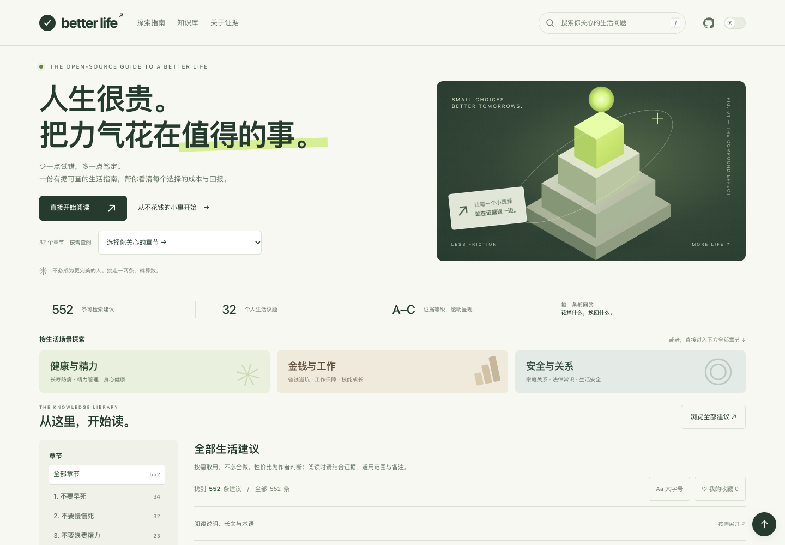

# Better Life · 高性价比人生指南

**人生很贵，把力气花在值得的事。**

[打开在线网站 ↗](https://jackyme.github.io/how-to-live-better/)

基于开源内容重设计的生活指南：32 个章节、552 条建议，按成本、收益与证据查阅。



## 为阅读而设计

- **找到起点**：健康与精力、金钱与工作、安全与关系三个场景。
- **自由切换**：章节选择、上一章 / 下一章、章内目录、完整阅读 / 只看说人话。
- **快速筛选**：全文搜索、A级证据、钱 / 时间 / 毅力，以及本地收藏。
- **舒适阅读**：深浅色、大字号、手机布局、减少动态效果支持。
- **完全离线**：单个 HTML 文件即可携带完整正文与阅读功能。

## 本地运行

Node.js 18+，无需安装依赖。

```sh
npm run dev
```

打开 http://127.0.0.1:4173。

## 构建离线版

```sh
npm run build
```

生成 `dist/HowToLiveBetter.html`，双击即可阅读。外部参考来源仍需联网访问。

## 内容与维护

- [正文目录与术语](CONTENT.md) · [补充长文](docs/) · [来源核实记录](docs/核实记录/)
- [人体系统专题](docs/人体系统专题.md)：7 篇原创导读、3 张原创插图，按章节推荐，支持搜索与离线阅读。
- `content/human-system.json`：专题内容与来源；修改后运行 `node tools/companions/build.mjs` 更新网页。
- `assets/responsive.css`：电脑、平板、手机的阅读字号、触控区域与横屏适配；由构建脚本内联到网页。
- `index.html`：网站界面与阅读交互。
- `book/`：32 章 Markdown 正文。
- `tools/offline/`：零依赖离线构建。
- [本地使用说明](START-HERE.md)

修改后运行 `npm run build`，再提交并推送：

```sh
git add .
git commit -m "更新网站内容与交互"
git push
```

推送到 `main` 后，GitHub Pages 自动更新在线网站。离线 HTML 仍使用 `npm run build` 在本地生成。

## 来源与许可

内容源自 [eternity4719/HowToLiveBetter](https://github.com/eternity4719/HowToLiveBetter)，按 [Unlicense](LICENSE) 使用。此仓库由 [JackyMe](https://github.com/JackyMe) 维护视觉与阅读体验改造，保留原文证据和不确定性，不代表对全部健康、法律或财务结论重新核实。

阅读交互参考 [cdyforever/how-to-live-better](https://cdyforever.github.io/how-to-live-better/)。

新增专题参考 [HumanSystemOptimization](https://github.com/zijie0/HumanSystemOptimization) 的主题组织，以原创导读和原文入口接入；未复制其正文或图片。该仓库未声明转载许可，其原文不适用本站许可。三篇知乎外链尚未取得正文，目前仅收录入口，详见[收录说明](docs/人体系统专题.md)。
