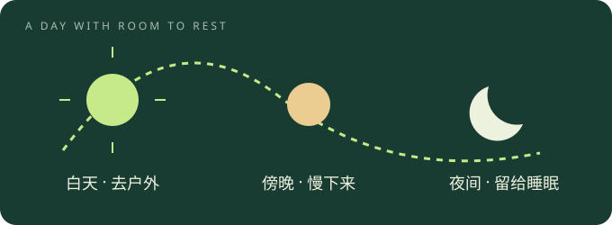
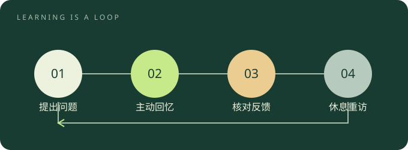
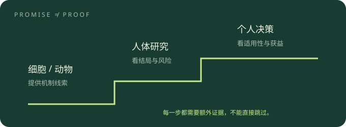

# 人体系统专题：来源、导读与收录边界

核对日期：2026-09-29。本站将 HumanSystemOptimization 的主题融入既有章节，增加 7 篇原创导读、3 张原创矢量图；原有 32 章、552 条建议保持独立。新增导读不是对原文的逐段翻译或全文转载，也未经过系统综述级核验。

## 来源与许可

主题来源：[zijie0/HumanSystemOptimization](https://github.com/zijie0/HumanSystemOptimization)，核对提交 `de3188fb1fbc8ac83fd72155df2c11ce9cddd2ba`。仓库包含一篇 README 长文及四张图片，未发现 LICENSE。这里不复制原文或原图；上游及外链内容不因被引用而适用本站的 Unlicense。本站新增文字、流程设计与 SVG 为独立编写。

## 文章收录状态

| 文章 / 视频 | 处理状态 |
| --- | --- |
| [人体系统调优不完全指南](https://github.com/zijie0/HumanSystemOptimization/blob/de3188fb1fbc8ac83fd72155df2c11ce9cddd2ba/README.md) | 已读主题正文 · 以原创导读融合 |
| [养生博主的 24 年总结](https://zhuanlan.zhihu.com/p/1896275046068094483) | 仅原文入口 · 正文未取得 |
| [养生博主的 23 年总结](https://zhuanlan.zhihu.com/p/675470252) | 仅原文入口 · 正文未取得 |
| [Lex Fridman 大佬的日常生活安排](https://zhuanlan.zhihu.com/p/371254789) | 仅原文入口 · 正文未取得 |
| [人体系统调优 · 作者视频版](https://www.bilibili.com/video/BV1EW4y1R7yi/) | 视频入口 · 未逐段核验 |

三篇知乎文章因访问失败未取得正文，仅建立链接，尚未完成其正文融合。取得可用正文及相应使用授权后，才能补充核对与整合。视频仅收录入口，未声称逐段审阅。

## 主题对应

| 原文范围 | 本站导读 | 相关章节 |
| --- | --- | --- |
| 背景、个人实践、工具和日常安排 | 一次只改一件事 | 3、4、22 |
| 睡眠原理、光照、睡眠实践 | 一天的节律 | 2、3 |
| Fasting 背景、实践、消化道健康 | 餐盘与进食窗口 | 2、16、28 |
| 多巴胺、动力、奖励、成长型思维 | 让开始变容易 | 3、4、22 |
| 神经可塑性、学习状态、专注、大脑健康 | 主动回忆的学习循环 | 4、23、30、32 |
| 长寿中的体育锻炼、个人运动实践 | 可持续的运动周 | 2、3、17、28 |
| 衰老、饮食、药物、细胞重编程 | 抗衰研究的证据距离 | 2、16、17、24 |

## 编辑取舍

- 公开健康建议链接到 WHO、NIH 等来源；本站排程与记录示例明确写作“建议”或“示例”。
- 原文中的精确刺激时长、补剂组合与剂量、处方药抗衰、一次训练永久改变大脑等，不转为本站行动处方。
- 保留断食、胆结石、低血糖及抗衰争议的阅读边界。设备分数和个人经历不作为因果或临床疗效证据。
- 不导入购物、品牌补剂推广、徽章或公众号推广。文末学术与非购物阅读链接仅为来源索引，未逐篇全文核验。

## 原创导读

### 把一天的节律，留给一夜好眠

先观察白天和夜晚的安排，再决定要不要增加“助眠工具”。

**留出睡眠时间**：多数成年人需要每晚 7–9 小时睡眠。先倒推上床时间，尽量稳定起床时间；别把少睡当作提高效率的捷径。

**给环境做减法**：白天安排户外活动，睡前降低灯光亮度、减少刺激性内容。是否调整咖啡时间，以入睡和夜间清醒的变化作为线索。

**记录真实感受**：可连续记录一周的睡眠时段与白天困倦程度。这是本站提供的观察方法，不是诊断量表；持续失眠、明显打鼾或白天嗜睡值得就医评估。

**边界与争议**：不把光照精确分钟数、冷水澡或镁与芹黄素配方作为通用处方；睡眠需求也不能用手环的一次评分替代。

[对应主题原文](https://github.com/zijie0/HumanSystemOptimization/blob/de3188fb1fbc8ac83fd72155df2c11ce9cddd2ba/README.md#睡眠) · [NHLBI：睡眠时长与质量](https://www.nhlbi.nih.gov/health/heart-healthy-living/sleep) · [NHLBI：失眠的治疗与睡眠习惯](https://www.nhlbi.nih.gov/health/insomnia/treatment)

### 先照顾餐盘，再讨论进食窗口

食物质量、能否坚持与身体状况，比追求一张完美的时间表更重要。

**从一餐开始**：以多样的蔬菜、水果、全谷物和豆类为基础，减少游离糖、过量盐及不健康脂肪。先选一餐做可持续的替换，不必一次改变全部饮食。

**把断食当作待评估选项**：间歇性断食并非人人必需，也没有在此被认定为人类延寿方案。使用降糖药、有进食障碍史、孕哺期或未成年人，应先咨询专业人员，不自行照搬成人限时饮食。

**身体不适优先处理**：不要用盐水代替低血糖处理。糖尿病患者若血糖低于个人目标或 70 mg/dL，且意识清醒、能够吞咽，NIDDK 建议立即摄入 15–20 克快速碳水，15 分钟后复测，仍低时重复处理。严重意识异常需急救，不强行喂食；具体用药相关处理见下方来源。

**边界与争议**：消化道健康也不能靠“空腹越久越好”判断。长时间不进食与快速减重可能增加胆结石风险；有胆囊问题时应个体化评估。

[对应主题原文](https://github.com/zijie0/HumanSystemOptimization/blob/de3188fb1fbc8ac83fd72155df2c11ce9cddd2ba/README.md#饮食) · [WHO：健康膳食](https://www.who.int/health-topics/healthy-diet) · [NIDDK：低血糖处理](https://www.niddk.nih.gov/health-information/diabetes/overview/preventing-problems/low-blood-glucose-hypoglycemia) · [NIDDK：节食与胆结石](https://www.niddk.nih.gov/health-information/digestive-diseases/gallstones/dieting)

### 让开始变容易，让反馈看得见

不必给自己的动力余额打分。把想做的事缩小到今天可以开始的动作。

**把目标变成动作**：本站建议：把“提高专注”改成“打开文档，写出三个问题”；把“坚持运动”改成“换鞋出门走一小段”。这是任务设计示例，不是多巴胺治疗方案。

**给过程留反馈**：记录完成了什么、哪里受阻、下次调整什么。成长型思维可以作为反思提示，但不能保证只要足够努力就一定获得某种结果。

**允许恢复与求助**：休息不需要先被证明有生产力。可尝试短暂、舒适的呼吸觉察；如果练习引起明显不适就停止。持续的情绪困扰应寻求合适的支持。

**边界与争议**：原文涉及多巴胺、奖励与冷刺激。神经递质不是一个可自行测算的“快乐余额”；本站不推荐以冰浴、补充剂或所谓聪明药调节它，也不承诺一次冥想永久改变大脑。

[对应主题原文](https://github.com/zijie0/HumanSystemOptimization/blob/de3188fb1fbc8ac83fd72155df2c11ce9cddd2ba/README.md#心态与动力) · [NCCIH：冥想的效果与安全性](https://www.nccih.nih.gov/health/meditation-and-mindfulness-effectiveness-and-safety)

### 合上资料，才知道学会了多少

把“看过”变成“能回忆、能应用”，给练习和休息都留位置。

**先提出问题**：阅读之前写下一个需要解决的问题。结束时合上资料，用自己的话回答，再对照资料纠正遗漏。

**隔一段时间再提取**：把一次长时间重复阅读拆成多次回忆和应用练习。间隔提取研究支持这种方向，但具体间隔应随材料难度与目标调整，没有通用神奇分钟数。

**为休息留空位**：NIH 报道的运动技能实验观察到练习间短休息与学习巩固有关。可以据此尝试练习—休息交替，但不能直接推导为所有学科的固定学习配方。

**边界与争议**：不把 25 岁当作学习能力的截止线，也不把倒立、前庭刺激、特殊补剂或极度压力当作学习必需条件。插图是一种学习流程建议，不是大脑活动测量结果。

[对应主题原文](https://github.com/zijie0/HumanSystemOptimization/blob/de3188fb1fbc8ac83fd72155df2c11ce9cddd2ba/README.md#学习与专注) · [Karpicke 与 Roediger：间隔提取实验](https://pubmed.ncbi.nlm.nih.gov/17576148/) · [NIH：短暂休息与技能学习](https://www.nih.gov/news-events/nih-research-matters/how-short-breaks-help-brain-learn-new-skills)

### 运动计划，先从能持续的一周开始

把有氧、力量与恢复放进生活，比追赶一个设备分数更有意义。

**有氧分散到一周**：WHO 建议成年人每周至少 150–300 分钟中等强度，或 75–150 分钟高强度有氧活动，或等效组合。尚未达到时，从能力允许的小量活动开始。

**给力量留位置**：成年人每周至少两天进行涉及主要肌群的力量活动。年长者还应重视平衡与功能训练，强度随健康状态和能力调整。

**久坐之间动一动**：本站提供的排程示例：选择几个可重复的散步时段，再安排两次力量练习。它不是人人适用的训练处方，也不要求购买穿戴设备。

**边界与争议**：PAI 或手环热量只能作为设备提供的线索，不能代替医学评估，也不作为这里的统一达标线。有基础疾病或运动中出现异常症状时，需调整计划并寻求专业评估。

[对应主题原文](https://github.com/zijie0/HumanSystemOptimization/blob/de3188fb1fbc8ac83fd72155df2c11ce9cddd2ba/README.md#体育锻炼) · [WHO：身体活动建议](https://www.who.int/news-room/fact-sheets/detail/physical-activity)

### 读懂抗衰研究的三层距离

从实验室结果到个人决策，中间还有适用人群、临床结局和安全性。

**先问研究在谁身上做**：细胞、动物与人体研究回答不同问题。细胞重编程的实验进展值得关注，但不能直接等同于可供普通人使用的返老还童治疗。

**再问测量了什么**：生物标志物变化、疾病风险与实际寿命不是同一结局。看到“生物年龄下降”，要继续追问研究规模、对照方式、随访时间与不良反应。

**最后才讨论个人选择**：将注意力优先放在睡眠、身体活动与膳食等已有公共健康建议的事项上。处方药是否适用由临床诊疗决定；不要为抗衰自行使用二甲双胍或组合补剂。

**边界与争议**：原文讨论 NMN、白藜芦醇、药物与细胞重编程，并补充了争议提醒。本站仅保留研究阅读入口，不给剂量、不卖产品、不承诺健康活到某个年龄。

[对应主题原文](https://github.com/zijie0/HumanSystemOptimization/blob/de3188fb1fbc8ac83fd72155df2c11ce9cddd2ba/README.md#长寿) · [NIA：模拟热量限制的药物研究](https://www.nia.nih.gov/news/live-long-good-health-could-calorie-restriction-mimetics-hold-key) · [NIA：断食研究与人体健康指标](https://www.nia.nih.gov/news/can-fasting-reduce-disease-risk-and-slow-aging-people)

### 一次只改一件事，给生活留下余量

把他人的日常当作灵感，把自己的记录当作观察；二者都不是因果证明。

**选一个低负担改变**：例如提前准备散步鞋、睡前给手机找一个固定位置，或学习结束后写一张回忆卡。不要同时改作息、饮食和训练，再猜是哪项起效。

**记下条件与感受**：本站建议记录日期、实际动作、精力感受及明显干扰因素。观察一段时间后再决定保留、调整或停止；周期长短不等于医学试验有效性。

**允许撤回**：如果新习惯增加焦虑、持续不适或影响正常生活，应停止并重新评估。生活改善不需要购买同款补剂，也不必照抄名人的整张日程。

**边界与争议**：作者的 2023、2024 年总结与 Lex Fridman 日程文章收在下方原文目录。当前无法读取这些知乎正文，因此这里只提供入口，不把标题当作内容、不编造其结论。

[对应主题原文](https://github.com/zijie0/HumanSystemOptimization/blob/de3188fb1fbc8ac83fd72155df2c11ce9cddd2ba/README.md#个人实践)

## 上游延伸阅读索引

以下是上游提供的非购物文章、研究及访谈入口。保留标题与链接不代表本站认可其中全部主张。

- [Rich Roll 采访 Andrew Huberman 的 podcast](https://youtu.be/2ekdc6jCu2E)
- [原版的 podcast 内容](https://hubermanlab.com/)
- [Yoga Nidra](https://youtu.be/M0u9GST_j3s)
- [自我催眠](https://www.youtube.com/c/MichaelSealey)
- [Christopher Gardner 关于生酮饮食与地中海饮食比较的研究](https://youtu.be/sJLK3sVexIk)
- [中国居民膳食指南](https://sspai.com/post/72984)
- [Mindset & Drive](https://hubermanlab.com/controlling-your-dopamine-for-motivation-focus-and-satisfaction/)
- [Nutrition, longevity and disease: From molecular mechanisms to interventions](https://www.cell.com/cell/pdf/S0092-8674(22)
- [The quest to slow ageing through drug discovery](https://www.nature.com/articles/s41573-020-0067-7)
- [Life Biosciences](https://www.lifebiosciences.com/)
- [Altos Labs](https://altoslabs.com/)
- [程序员延寿指南](https://github.com/geekan/HowToLiveLonger)
- [二甲双胍](https://zh.m.wikipedia.org/zh/%E4%BA%8C%E7%94%B2%E5%8F%8C%E8%83%8D)
- [Bloch, H. M. 等人的论文](https://www.ncbi.nlm.nih.gov/pmc/articles/PMC1419405/)
- [Dr. Berg 也以此做了解释](https://youtu.be/2lGuXBwudKw)
- [Sichieri, R. 等人的论文](https://www.ncbi.nlm.nih.gov/pmc/articles/PMC1405175/)
- [咖啡是否会引发胆结石](https://www.coffeeandhealth.org/factsheet/gallstones-factsheet)
